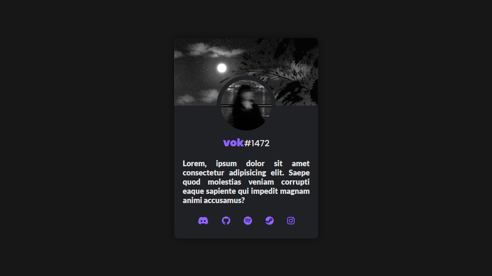

# Profile-Card
Carta de usuário de tema escuro inspirado em um tema Discord.

# Imagem do Resultado


# Usando Favicon
Favicon é um gerador e conversor de ícones ( .ico ) com diversas possibilidades de layouts e ideias. Link > https://favicon.io

### Arquivo JSON

```json
{
  "name": "",
  "short_name": "",
  "icons": [
    {
      "src": "/android-chrome-192x192.png",
      "sizes": "192x192",
      "type": "image/png"
    },
    {
      "src": "/android-chrome-512x512.png",
      "sizes": "512x512",
      "type": "image/png"
    }
  ],
  "theme_color": "#ffffff",
  "background_color": "#ffffff",
  "display": "standalone"
}
```

# font-awesome
Toolkit para Fontes e Ícones para CSS.

### Linkando arquivo all.min.css
```html
<link rel="stylesheet" href="https://cdnjs.cloudflare.com/ajax/libs/font-awesome/5.15.4/css/all.min.css">
```

### cdnjs Link
https://cdnjs.com/libraries/font-awesome

### Versão Utilizada > 5.15.4
Link > https://cdnjs.cloudflare.com/ajax/libs/font-awesome/5.15.4/css/all.min.css

# Google Fonts API
Site contendo diversas famílias de fontes gratuítas e open-source para serem utilizadas no CSS.

### Fontes utilizadas

- Poppins ( 500 e 900 ) > https://fonts.google.com/specimen/Poppins?query=poppins
```css
@import url('https://fonts.googleapis.com/css2?family=Poppins:wght@500;900&display=swap');
```

---

- Lato ( 900 ) > https://fonts.google.com/specimen/Lato?query=lato
```css
@import url('https://fonts.googleapis.com/css2?family=Lato:wght@900&display=swap');
```

Link para Google Fonts > https://fonts.google.com
